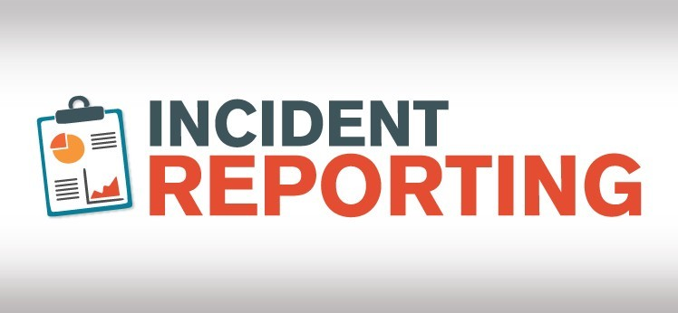

อุบัติการณ์ (Incident)
==

**อุบัติการณ์ (Incident)** หมายถึง เหตุการณ์ทั้งที่เกิดขึ้นแล้วและสร้างความเสียหายหรือไม่สร้างความเสียหาย หรือการละเมิดนโยบาย ระเบียบ ข้อกำหนด แต่หากปล่อยเหตุการณ์นั้นไว้ อาจส่งผลเชิงลบ หรือนำไปสู่การเกิดเหตุขัดข้อง (Weakness)

**เหตุการณ์ (Event)** เหตุการณ์ที่เกี่ยวข้องกับความมั่นคงปลอดภัยสนเทศหรือการให้บริการที่ยังไม่เกิดขึ้น หรือยังไม่ได้สร้างความเสียหาย หรือละเมิดนโยบาย ระเบียบ ข้อกำหนด แต่หากปล่อยเหตุการณ์นั้นไว้ อาจส่งผลเชิงลบ หรือนำไปสู่การเกิดอุบัติการณ์

**อุบัติการณ์ทางด้านความมั่นคงปลอดภัย (Security Incident)** หมายถึง อุบัติการณ์ที่เกี่ยวกับความมั่นคงปลอดภัยของระบบสารสนเทศ จนส่งผลทำให้ระบบสารสนเทศไม่สามารถดำเนินการได้ตามปกติ เช่น การแพร่กระจายโปรแกรมไม่ประสงค์ดี (Virus) เข้าสู่ระบบ ,การสร้างเว็บไซต์ปลอม (Phishing) เพื่อหลอกให้เหยื่อเปิดเผยข้อมูลที่สำคัญ ,การเปิดเผยข้อมูลความลับ ,การแก้ไขข้อมูลโดยไม่ได้รับอนุญาต เป็นต้น

**อุบัติการณ์ทางด้านการปฏิบัติการ (Operational Incident)** หมายถึง เป็นอุบัติการณ์ที่เกี่ยวกับการดำเนินการ จนส่งผลทำให้ระบบสารสนเทศไม่สามารถดำเนินการได้ตามปกติ เช่น ระบบเกิดการล้มเหลว ,ระบบไม่สามารถให้บริการได้ ,การสำรองข้อมูลล้มเหลว เป็นต้น

---

## บทความที่ 1 

บทความเรื่อง การบริหารเหตุละเมิดความมั่นคงปลอดภัยแบบเร่งรัดตาม ISO 27001:2013
==

**เหตุละเมิดความมั่นคงปลอดภัย**  หรือ **Security Incident** นั้น คืออะไรก็ตามที่ขัดขวางความมั่นคงปลอดภัยไม่ให้เป็นไปตามเป้าหมายหรือวัตถุประสงค์ ซึ่งโดยทั่วไปแล้ว **“ความมั่นคงปลอดภัย”** จะหมายถึง การคงไว้ซึ่ง **“CIA”** - โดย **C**  นั้นมาจาก Confidentiality (ความลับ) - สำหรับ **I**  นั้น มาจาก Integrity (ความถูกต้องครบถ้วน) - ส่วน **A**  นั้น มาจาก Availability (ความพร้อมใช้งาน) ดังนั้น สิ่งใดก็ตามที่ส่งผลกระทบในเชิงลบต่อ **CIA** **จึงถือเป็นเหตุละเมิดความมั่นคงปลอดภัยทั้งสิ้น**

  
ตัวอย่างของเหตุละเมิดความมั่นคงปลอดภัยที่พบเห็นได้ทั่วไป อาทิ

- การติดไวรัส  
- การโจมตีทางไซเบอร์  
- ข้อมูลรั่วไหลหรือถูกเปิดเผยโดยไม่ได้รับอนุญาต
- การเข้าถึงระบบโดยไม่ได้รับอนุญาต
- การฝ่าฝืนนโยบาย/ขั้นตอนการปฏิบัติงาน/กฎหมาย

  
ถ้ามองในมุมของการบริหารจัดการ เหตุละเมิดความมั่นคงปลอดภัยแม้เพียงเล็กน้อยก็ถือเป็นปัจจัยหรือจุดเริ่มต้นของความผิดพลาดในการให้บริการขององค์กรได้ รวมถึงอาจจะทำให้ระดับความมั่นคงปลอดภัยขององค์กรลดลงต่ำกว่า Acceptable Level  ที่มีการกำหนดไว้ก็เป็นได้ ดังนั้น องค์กรจึงจำเป็นที่จะต้องมีการวางแผนเตรียมรับมือกับเหตุละเมิดความมั่นคงปลอดภัยที่อาจจะเกิดขึ้น โดยคำนึงถึงความสมเหตุสมผลและความคุ้มค่าในการลงทุน ซึ่งอาจจะอาศัยแนวทางจากมาตรฐานสากลต่างๆ เช่น ISO 27001:2013  หรือ ISO 27035  เป็นต้น ที่สำคัญก็คือจะต้องเป็นแผนงานหรือกระบวนการที่สามารถปฏิบัติใช้ได้จริง และมีการทบทวนและทดสอบกระบวนการอยู่เสมอ  

ทั้งนี้ เพื่อเป็นทางลัดให้องค์กรของคุณมีกระบวนการรับมือหรือตอบสนองต่อเหตุละเมิดความมั่นคงปลอดภัยเอาไว้ใช้งานเบื้องต้น ทีมที่ปรึกษา **Destination One**  จึงขอเสนอ**กระบวนการบริหารจัดการเหตุละเมิดความมั่นคงปลอดภัยแบบเร่งรัด**  ดังนี้
  

1. **การรายงาน /  การแจ้งเหตุ** : เหตุการณ์หรือจุดอ่อนด้านความมั่นคงปลอดภัยนั้นคืออะไร ต้องแจ้งเหตุไปที่ผู้ใด แจ้งด้วยช่องทางใด  ต้องแจ้งข้อมูลอย่างไรบ้าง  

2. **การวิเคราะห์ /** **การประเมินเบื้องต้น** : สิ่งที่ตรวจพบเข้าเกณฑ์ที่จัดเป็น “เหตุละเมิดความมั่นคงปลอดภัย” หรือไม่ ใครต้องเป็นผู้รับผิดชอบในการวิเคราะห์และประเมิน และเมื่อประเมินเสร็จแล้วจะต้องส่งเรื่องต่อไปที่แผนกใด  

3. **การตอบสนองต่อเหตุละเมิดความมั่นคงปลอดภัย** : จะต้องพิจารณาว่าควรจะตอบสนองต่อเหตุละเมิดแต่ละประเภทอย่างไร ใครคือผู้รับผิดชอบ สาเหตุของเหตุละเมิดคืออะไร และวางแผนแก้ไขเหตุทั้งระยะสั้น และระยะยาว โดยมีแนวทางดังนี้

- การควบคุมหรือจำกัดความรุนแรงของเหตุละเมิด
- การแก้ไขและกำจัดเหตุละเมิด
- การกู้คืนระบบ
- การติดต่อสื่อสาร
- การทบทวนเหตุละเมิด  

**การเรียนรู้และการปรับปรุงกระบวนการ** : จากเหตุละเมิดที่เกิดขึ้น คุณได้รับบทเรียนอะไรบ้าง ได้รับความรู้หรือแนวปฏิบัติใหม่ๆ เพิ่มเติมบ้างไหม  

**การจัดเก็บหลักฐาน** : ในการจัดเก็บบันทึกและหลักฐานเกี่ยวกับเหตุละเมิดนั้น ใครคือผู้รับผิดชอบ จัดเก็บที่ใด และมีกระบวนการจัดเก็บอย่างไร

  

  

หากคุณต้องการให้บริการขององค์กรมีความราบรื่นต่อเนื่องและมั่นคงปลอดภัย ผู้บริหารและทีมงานจะต้องร่วมมือกันกำหนดกระบวนการบริหารจัดการเหตุล่วงละเมิดที่มีประสิทธิภาพ เพื่อลดผลกระทบเชิงลบที่อาจจะเกิดขึ้นกับองค์กร สิ่งที่คุณจำเป็นต้องพึงระลึกไว้เสมอก็คือ **“_เหตุล่วงละเมิดความมั่นคงปลอดภัย ยิ่งเจอเร็ว แก้ไขได้เร็ว ผลกระทบก็จะยิ่งน้อยลง_”**

> Reference : http://destinationonecounselor.blogspot.com/2014/12/iso-270012013.html
> 
----

## บทความที่ 2 

มาตรฐาน ISO 27001
==

**การบริหารจัดการเหตุการณ์ที่เกี่ยวข้องกับความมั่นคงปลอดภัยขององค์กร (Information security incident management)** โดยได้กล่าวถึงบทบาทของหัวหน้างานสารสนเทศ หัวหน้างานนิติกร ผู้ดูแลระบบและพนักงานในด้านต่างๆ ดังต่อไปนี้
1. การรายงานเหตุการณ์และจุดอ่อนที่เกี่ยวข้องกับความมั่นคงปลอดภัย เพื่อให้เหตุการณ์และจุดอ่อนที่เกี่ยวข้องกับความมั่นคงปลอดภัย ของระบบสารสนเทศขององค์กร ได้รับการดำเนินการที่ถูกต้องในช่วงระยะเวลาที่เหมาะสม  
2. การบริหารจัดการและการปรับปรุงแก้ไขต่อเหตุการณ์ที่เกี่ยวข้องกับความมั่นคงปลอดภัย เพื่อให้มีวิธีการที่สอดคล้อง และได้ผลในการบริหารจัดการเหตุการณ์ที่เกี่ยวข้องกับความมั่นคงปลอดภัยสำหรับสารสนเทศขององค์กร

> ที่มาบทความ : http://prowcharinrat.blogspot.com/2016/05/iso-27001.html

-----

## เอกสารเพิ่มเติม
- [เอกสาร ISO/IEC 27001:2013 ของภาควิชาการสื่อสารข้อมูลและเครือข่าย คณะเทคโนโลยีสารสนเทศ มหาวิทยาลัยเทคโนโลยพระจอมเกล้าพระนครเหนือ ](doc-01.pdf)
- [แนวทางการตรวจสอบภายในตามมาตรฐาน I SO 27001 : 2013 กรณีศึกษาการทางพิเศษแห่งประเทศไทย](doc-02.pdf)
- [รอบรู้นโยบาย ความมั่นคงปลอดภัยของสารสนเทศ มหาวิทยาลัยศรีนครินทรวิโรฒ](doc-03.pdf)

